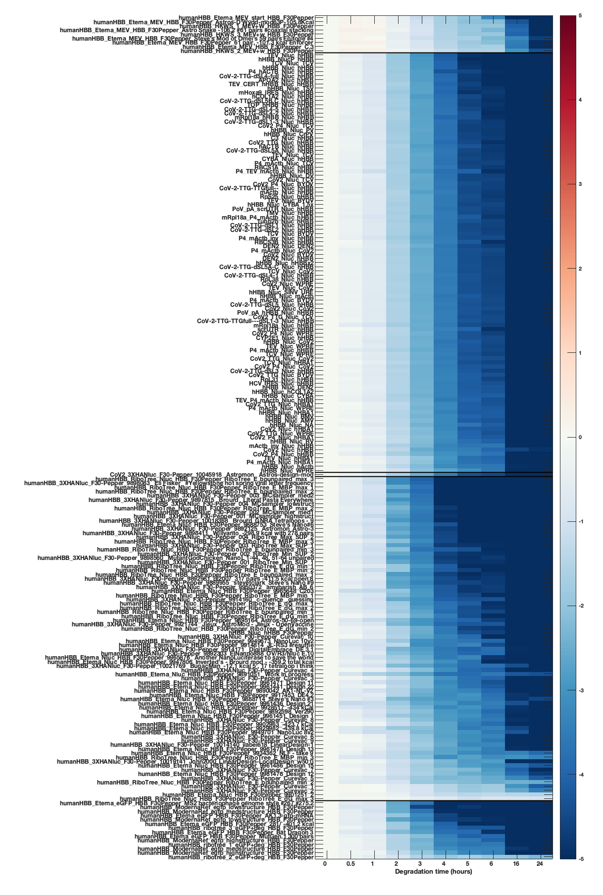
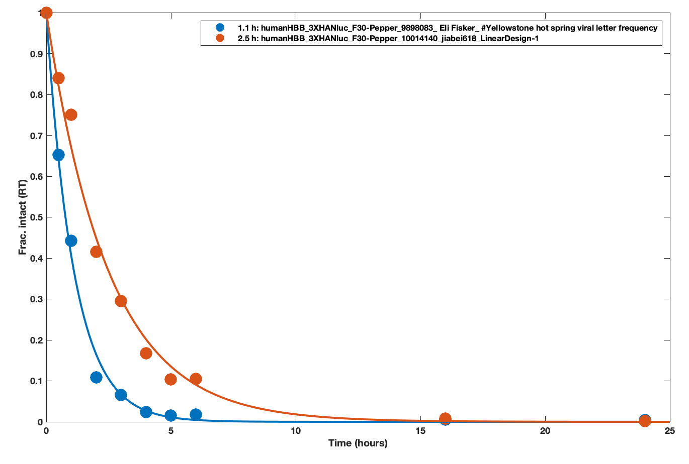

# `persist_seq_in_solution_matlab`

## What this is
Scripts to numbers for in solution stability adapted from PERSIST-seq measurements in paper [Combinatorial optimization of mRNA structure, stability, and translation for RNA-based therapeutics](https://www.biorxiv.org/content/10.1101/2021.03.29.437587v1)

## How to run
You'll need MATLAB and to put the folder `matlab_scripts` in your path.

Then run in MATLAB:

```
Rhiju_233x_stability_analysis_SCRIPT
```

and output should look like the followig images.

Also, data output will go to a tab-delimitted file `Rhiju_233x_stability_analysis_OUTPUT.txt`. Note that errors  (last column) are estimated from stochastic non-parametric bootstrapping and will vary a bit from run to run. 

Note that data in the output for 12 of the 203 mRNA's that could be RT-PCR'ed are filtered out, 10 based on anomalous 'persistence' into the last timepoint (24 hours) which appears in separate studies to be due to a RT-PCR mispriming artefact, 1 sequence from a COV2-Eterna study that had no valid priming sites, and 1 sequence related to a 3' UTR ENE mRNA that caused confusion with barcoding.


## Example output
Heatmap of in-solutin degradation data from PERSIST-seq pipeline after normalization steps:



Exponential fits to a couple of the mRNA data sets:


Output of data into MATLAB command window and also in `Rhiju_233x_stability_analysis_OUTPUT.txt`. Note that errors  (last column) are estimated from stochastic non-parametric bootstrapping and will vary a bit from run to run.

```
...
196	720102B1	CoV-2-TTG-dSL5B,C_Nluc_hHBB	0.581866	0.019532
197	720103B1	CoV-2-TTG-dSL5A-C_Nluc_hHBB	0.524312	0.029295
198	720104B1	CoV-2-TTG-dSL5_Nluc_hHBB	0.523060	0.027798
199	720105B1	CoV-2-TTG-dSL1-3_Nluc_hHBB	0.576818	0.022464
200	720106B1	CoV-2-TTG-dSL4-5_Nluc_hHBB	0.567876	0.029277
201	720107B1	CoV-2-TTG-TTGfull­­_Nluc_hHBB	0.569314	0.015774
202	720108B1	CoV-2-TTG-TTGfull­­-dSL1-3_Nluc_hHBB	0.520085	0.027553
```